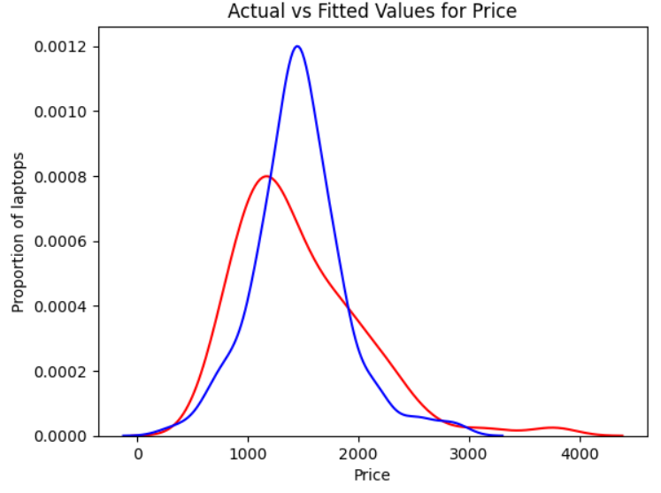
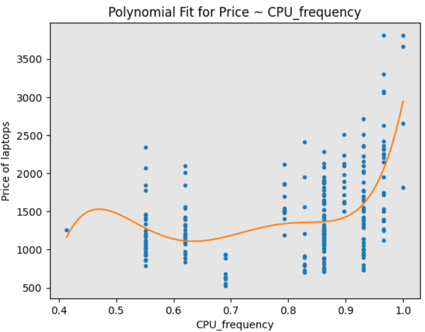

<h1 align="center">💻 Laptop Price Prediction</h1>

  Predicting laptop prices from technical specifications using regression models, cross-validation, and feature engineering.

---

## 📈 Business Problem

Laptop manufacturers, retailers, and e-commerce platforms often face challenges in **pricing new or refurbished laptops** competitively. Underpricing can result in revenue loss, while overpricing leads to poor sales. 

This project aims to **build a predictive model** that estimates laptop prices based on their technical specifications (CPU, GPU, RAM, screen, storage, etc.) to:

- Help businesses automate pricing decisions.
- Detect outliers or inconsistencies in historical price data.
- Support dynamic pricing strategies on online platforms.

---

## 🧭 Methodology

The project follows a **structured machine learning pipeline**:

1. **Data Understanding & Cleaning**
2. **Exploratory Data Analysis (EDA)**
3. **Feature Engineering & Encoding**
4. **Model Development**:
   - Linear Regression
   - Polynomial Regression
   - Ridge Regression
5. **Model Evaluation & Cross-Validation**
6. **Hyperparameter Tuning using GridSearchCV**
7. **Model Selection & Business Insights**

---

## 📂 Dataset Overview

🔗 [Laptop pricing dataset](https://cf-courses-data.s3.us.cloud-object-storage.appdomain.cloud/IBMDeveloperSkillsNetwork-DA0101EN-Coursera/laptop_pricing_dataset_mod2.csv)
- 📦 **Rows**: 238 laptops
- 🧩 **Target**: `Price` (in USD)
- 🎯 **Features**: Laptop brand, hardware specifications, screen characteristics, and OS.

### 🧾 Data Summary

| Column              | Description                                                  |
|---------------------|--------------------------------------------------------------|
| `Manufacturer`      | Brand of the laptop (e.g., Dell, HP, Apple)                  |
| `Category`          | Encoded laptop type/category (e.g., Ultrabook, Gaming)       |
| `GPU`               | Encoded GPU type (e.g., Integrated, NVIDIA, AMD)             |
| `OS`                | Encoded operating system (e.g., Windows, MacOS, Linux)       |
| `CPU_core`          | Number of CPU cores                                          |
| `Screen_Size_inch`  | Physical screen size in inches                               |
| `CPU_frequency`     | Normalized CPU frequency (scaled)                            |
| `RAM_GB`            | Installed RAM in gigabytes                                   |
| `Storage_GB_SSD`    | SSD storage capacity in gigabytes                            |
| `Weight_pounds`     | Weight of the laptop in pounds                               |
| `Price`             | Target variable – Price of the laptop in USD                 |
| `Price-binned`      | Categorized price label (e.g., Low, Medium, High)            |
| `Screen-Full_HD`    | Binary flag indicating Full HD screen (1 = Yes)              |
| `Screen-IPS_panel`  | Binary flag indicating IPS screen panel (1 = Yes)            |

---

## 🧪 Exploratory Data Analysis (EDA)

EDA was used to detect patterns, correlations, and distributions:

- **Price** is right-skewed — normalized using transformations.
- **RAM**, **SSD size**, and **CPU frequency** show **positive correlation** with price.
- Laptops with **IPS** and **Full HD** screens tend to be priced higher.
- **Brand** influences pricing significantly (e.g., Apple vs Acer).

Heatmaps and pairplots helped understand multi-feature interactions.

---

## 🧹 Feature Engineering & Preprocessing

- Removed redundant index columns (`Unnamed: 0`, etc.)
- Converted categorical variables (`Manufacturer`, `GPU`, `OS`) into numerical form using **Label Encoding**
- Normalized numerical features like `CPU_frequency`
- Engineered binary flags:
  - `Screen-Full_HD`
  - `Screen-IPS_panel`

All transformations were encapsulated in **Scikit-learn Pipelines**.

---

## 🧰 Tools & Libraries Used

| Tool/Library         | Purpose |
|----------------------|---------|
| `pandas`             | Data manipulation and DataFrame handling |
| `numpy`              | Numerical operations and array transformations |
| `matplotlib`         | Plotting line charts, histograms, scatter plots |
| `seaborn`            | High-level visualization: heatmaps, pairplots |
| `scikit-learn`       | ML algorithms, pipelines, cross-validation, and metrics |
| `Pipeline`           | Chaining preprocessing + model in clean workflow |
| `PolynomialFeatures` | Transform features into polynomial terms |
| `Ridge`              | Ridge regression (L2 regularization) |
| `GridSearchCV`       | Hyperparameter tuning with cross-validation |

---

## 🤖 Model Development

### 🔹 Linear Regression

**Linear Regression** is a fundamental algorithm used to model the relationship between a dependent variable (`Price`) and one or more independent variables (e.g., `RAM_GB`, `CPU_core`, etc.).

- ✔️ **Univariate Model**: Started with `CPU_frequency` to build a baseline linear regression.
- ✔️ **Multivariate Model**: Incorporated additional predictors such as `RAM_GB`, `SSD`, and `CPU_core` to improve accuracy.
- 🔍 **Purpose**: Understand how each hardware spec contributes to price in a linear fashion.

📉 _Limitation_: Struggles when the relationship between features and price is non-linear.

---

### 🔸 Polynomial Regression

**Polynomial Regression** is an extension of linear regression where the relationship between the features and the target is modeled as an nth-degree polynomial.

- 🔢 Generated **degree-2 and degree-3 polynomial features** using `PolynomialFeatures`
- 🚀 This helped the model fit more complex patterns like the curved relationship between `CPU_frequency` and `Price`
- 🛠 Integrated into a **Pipeline** for scalability and repeatability

📈 _Benefit_: Significantly improved model performance by capturing non-linearity.

---

### 🧩 Ridge Regression

**Ridge Regression** (a form of **regularized linear regression**) introduces an **L2 penalty** to the loss function to reduce overfitting by shrinking model coefficients.

- 🔍 Ideal when there is multicollinearity or when the number of predictors is high.
- 🧪 Used `Ridge(alpha)` with **GridSearchCV** to find the optimal regularization strength (`alpha`)
- ⛏️ Final model included **polynomial features** + ridge regularization + 5-fold cross-validation.

📌 _Result_: Best generalization performance on test data with the lowest MSE and highest R².

---

## 📈 Model Evaluation

Evaluation metrics used:
- **MSE** (Mean Squared Error)
- **R² Score** (Goodness of fit)

| Model                 | MSE (Train) | MSE (Test) | R² Score (Test) |
|-----------------------|-------------|------------|------------------|
| Linear Regression     | Medium      | Higher     | 0.72 approx      |
| Polynomial Regression | Lower       | Moderate   | ~0.78            |
| Ridge Regression      | Best        | Lowest     | ~0.82            |

✅ **Best Model**: **Ridge Regression** with degree-2 polynomial features and alpha optimized via grid search.

---

## 📋 Results Summary

- Polynomial models outperformed linear models by capturing **non-linear patterns** in the data.
- Ridge regression helped prevent **overfitting**, achieving the **highest generalization performance**.
- Hyperparameter tuning using **GridSearchCV** yielded optimal performance with low test MSE and high R² score.

---

## 💡 Top Business Insights

1. 💰 **RAM**, **CPU**, and **SSD capacity** are strong drivers of price.
2. 🖥️ **IPS and Full HD** screens consistently lead to higher pricing tiers.
3. 🧱 **Brand (Manufacturer)** has a significant, often premium-based effect.
4. 🧮 **CPU Frequency + Core count** show a clear step-up in pricing.
5. ⚖️ **Weight** and screen size affect price but in nonlinear ways.

---

## 🧠 Strategic Recommendations

- ✅ Manufacturers should highlight **screen quality**, **RAM**, and **SSD** in product listings for higher perceived value.
- 📦 E-commerce platforms can **auto-suggest prices** for new listings using this model.
- 🔎 Use the model as a **pricing audit tool** to detect outliers or mispriced products.
- 📊 Consider using this regression pipeline in **real-time dashboards** for internal decision support.

## 📬 Contact

If you'd like to connect or discuss this project:

- 📧 Email: [abdouhall58@gmail.com](mailto:abdouhall58@gmail.com)
   
- 💼 LinkedIn:  
